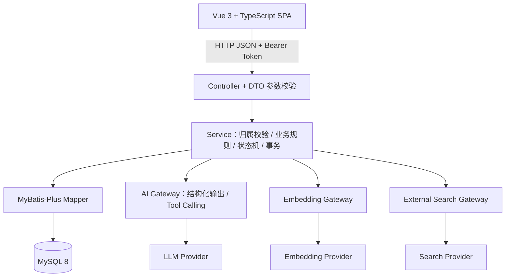

# Career Platform · 大学生职业发展与求职管理平台

面向大学生的职业发展与求职管理平台：把职业目标、学习计划、简历版本、岗位与投递、面试与复盘串成一条可追溯的闭环，并在关键节点由 AI 生成候选建议，**经用户确认后才进入业务系统**。

**技术栈**：Java 21 · Spring Boot 3.5 · MyBatis-Plus · MySQL 8 · Spring AI 1.1（DeepSeek）· Vue 3 · TypeScript · Vite · Element Plus

> 后端 269 个 Java 文件 / 约 1.46 万行 · 前端 21 个路由页面 · 327 个后端测试全绿（0 失败 / 0 错误 / 0 跳过）

## 1. 项目介绍

大学生搜集岗位的渠道分散在企业公众号、招聘网站、备忘录和表格里，导致很难回答"当时用的是哪一版简历、经历了哪些测评和面试、最后为什么结束"。本项目把这条链路收敛到一个系统中，让每一步都能被追溯。

```
共享基础档案 → 职业目标 → 岗位与原始 JD → AI 解析候选 → 用户确认 → 要求入库
                     ↓
        学习计划与任务 → 学习资料与有来源问答 → 周复盘
                     ↓
        简历 DRAFT → 编辑 / 复制 → FINALIZED → 投递 → 测评 / 面试 / Offer → 复盘
```

**AI 在系统中的角色是辅助能力，不是系统依赖。** AI 只生成候选（结构化岗位要求、学习计划、岗位发现、资料问答），任何需要持久化的结果都必须经过用户确认与 Java 侧校验。AI、外部搜索、向量服务全部默认关闭；未配置时传统业务链路完整可用，相关入口返回明确的降级提示。

## 2. 我做了什么

个人项目，独立完成从业务建模到测试的全部环节：

- **业务建模与数据库设计**：把 4 个业务域 + 1 个共享档案抽象成 29 张业务表，用 owner-aware 复合外键保证"用户 A 的数据不可能被用户 B 引用"。
- **后端架构**：按 `auth / user / profile / career / learning / resume / application / ai` 分包；Controller 只做协议转换，业务规则、归属校验、状态机与事务收敛在 Service 层。
- **AI 边界设计**：定义并落地"AI 提案 → 用户确认 → Java 校验 → 事务落库"这一强制约束，覆盖 4 个 AI 能力。
- **RAG 链路**：PDF/DOCX 解析、分块、独立 Embedding、owner/plan 范围检索，以及**由 Java 重建的可信引用**。
- **投递状态机与文件安全**：有限状态迁移 + 并发一致性保障；上传文件的魔数校验、ZIP 结构校验、解压炸弹限制与文件名清洗。
- **前端与测试**：Vue 3 + TypeScript 实现 21 个路由页面；52 个测试类覆盖单元、真实 MySQL 集成、并发、事务回滚与 AI 类型转换。

## 3. 核心技术亮点

### 3.1 AI 提案 → 用户确认 → Java 校验 → 事务落库
**"不信任模型输出"是一条架构约束，不是一个建议。** AI 解析岗位 JD 时只返回候选，不写任何业务表。确认阶段重新执行完整校验：owner 校验、资源状态校验、`sourceFingerprint`（原始 JD 的 SHA-256）比对（不一致直接拒绝并提示重新解析）、技能关联规则校验、归一化去重，最后在单个事务内写入；确认接口不会再次调用 AI。四个 AI 能力都遵循同一模式：模型既不能生成可信的数据库 ID，也不能直接提交事务。
`相关代码：ai/service/JdParseService.java · ai/controller/LearningAiController.java · ai/service/JobDiscoveryService.java`

### 3.2 RAG 可信引用
检索的 SQL 层就用 `user_id` + `plan_id` + 索引状态 + embedding 身份限定边界，Java 侧再做一次防御性校验。模型只被允许返回引用键（`c1`~`c4`），**真实的 materialId、chunkId、页码与原文全部由 Java 从本次检索集重建**，未知引用键直接判为非法返回。网络 I/O 之后会再次确认引用仍然存在且原文未被修改，避免把已变更的证据当作依据返回；检索不到足够证据时直接返回"依据不足"，不强行生成答案，也不调用模型。
`相关代码：ai/service/RagService.java · learning/mapper/LearningMaterialChunkMapper.java`

### 3.3 投递状态机与并发一致性
投递阶段由一张显式的迁移矩阵约束（`APPLIED → ASSESSMENT / INTERVIEW / OFFER / ENDED`，`ENDED` 为终态），非法迁移直接拒绝。并发正确性由**三层**保障，而不是只依赖事务：① 更新时带上前置状态条件（CAS），并发双迁移会命中 0 行而被拒绝；② 创建投递、创建/更新 Offer、写最终复盘前对父资源加行锁，把"检查 + 写入"串行化；③ 数据库唯一约束作为最后一道防线，唯一键冲突映射为 409。阶段变更与历史记录追加在同一事务内提交，非法迁移不会留下半写历史。
`相关代码：application/service/ApplicationService.java`

### 3.4 外部搜索安全
模型**看不到真实 URL**：每个搜索结果在服务端被分配一个不透明键，模型只能引用键，URL 与来源事实由 Java 从请求级会话中取回。同时做了 SSRF 防护：仅允许 http/https、拒绝携带用户信息的 URL、拒绝 localhost 与内网地址（含 IPv4 私有段、链路本地、IPv6 ULA）。HTTP 客户端禁用重定向、设置连接与请求超时，并对响应体做流式大小限制（超限立即取消读取）。来源事实（URL、标题、host、摘要、日期）与模型建议分开建模与返回，搜索摘要不会被当作完整 JD 写入。
`相关代码：ai/service/JobSearchSession.java · ai/client/TavilyJobSearchGateway.java`

### 3.5 文件上传安全
上传的 PDF/DOCX 不信任扩展名与客户端声明的 MIME：校验文件头魔数（PDF 签名、DOCX 的 ZIP 结构）、校验 DOCX 必需的内部条目、限制 ZIP 条目数量与**解压后总字节数**（防压缩炸弹）、清洗文件名中的路径穿越字符并做长度截断。原件以 BLOB 存储但**不参与普通查询**，只有显式下载接口才按 owner 读取；响应带 `nosniff` 与安全的内容处置头。简历版本定稿后内容只读，复制版本会复制出独立的数据行。
`相关代码：resume/service/ResumeFileValidator.java · learning/service/LearningMaterialIngestionService.java`

## 4. 核心业务模块

| 模块 | 功能 | 关键约束 |
| --- | --- | --- |
| 共享基础档案 | 个人资料、教育、技能、项目、实习、证书/获奖 | 其他模块的事实源；全部按 owner 隔离 |
| 职业探索 | 职业目标、公司、岗位、岗位要求、岗位笔记 | 岗位只能引用本人的公司；技能类要求必须关联已有技能 |
| 学习提升 | 周计划、任务、学习记录、周复盘、笔记、学习资料 | 计划与任务同事务创建；周复盘对每个计划唯一 |
| 简历管理 | 简历、版本、内容条目、原件文件 | 定稿后只读；只有定稿版本可用于投递；复制版本数据独立 |
| 求职过程 | 投递、阶段历史、测评、面试、Offer、最终复盘 | 状态机约束；同岗位同时只允许一个进行中投递 |
| AI 能力（嵌入各模块） | JD 结构化解析、学习计划与周复盘建议、岗位发现、资料问答 | 一律为候选；确认前不写正式业务数据 |

## 5. 系统架构



认证使用轻量 MVC Interceptor + JWT：除注册与登录外的所有 `/api/v1/**` 端点都要求合法 Bearer Token，当前用户 ID 由拦截器写入请求上下文，再通过参数解析器注入 Controller，**不接受客户端提交的 userId 作为归属依据**。

AI 写入边界时序图、投递状态机图与核心实体关系图见 [系统架构与设计决策](docs/ARCHITECTURE.md) 与 [数据库设计](docs/DATABASE.md)。

## 6. 界面截图

| Dashboard —— 职业、学习、简历与投递的总览入口 | JD AI 解析 —— 结构化要求 + 可回溯的证据片段 |
| --- | --- |
|  |  |

| 岗位发现 —— 候选岗位与原始来源入口 | 资料问答 —— 回答与可信来源依据 |
| --- | --- |
|  |  |

其余界面截图保存在 [`docs/assets/screenshots`](docs/assets/screenshots) 目录。

## 7. Quick Start

**环境要求**：JDK 21 · MySQL 8 · Node.js 18+ 与 npm

**1. 初始化数据库** —— 创建 `career_platform` 数据库（字符集 `utf8mb4`），然后按顺序执行 `sql/001_create_app_user.sql` 至 `sql/009_add_resume_file.sql`。其中 `007` ~ `009` 是增量脚本，请先确认当前 schema 状态再执行，避免重复 `ALTER`。

**2. 配置本地参数** —— 复制 `src/main/resources/application-local.properties.example` 为同目录下的 `application-local.properties`，填入自己的数据库账号、JWT 密钥与可选的 AI / 搜索 / 向量服务配置。该文件已被 `.gitignore` 忽略，不会被提交。也可以改用环境变量：必填 `DB_USERNAME`、`DB_PASSWORD`、`JWT_SECRET`（至少 32 字节），可选 `JWT_EXPIRATION_SECONDS`、`AI_CHAT_ENABLED`、`AI_CHAT_PROVIDER`、`AI_API_KEY`、`TAVILY_SEARCH_ENABLED`、`TAVILY_API_KEY`、`EMBEDDING_ENABLED`、`EMBEDDING_ENDPOINT`、`EMBEDDING_MODEL`、`EMBEDDING_VERSION`、`EMBEDDING_API_KEY`。

**3. 启动后端**（Windows 下改用 `mvnw.cmd`）：

```bash
./mvnw spring-boot:run -Dspring-boot.run.profiles=local
```

**4. 启动前端**（Vite 已将 `/api` 代理到 `http://localhost:8080`）：

```bash
cd frontend && npm install && npm run dev
```

**5. 运行测试**（集成测试使用真实 MySQL，需先完成第 1、2 步）：

```bash
./mvnw test
```

## 8. 测试

后端测试全部使用真实 MySQL（不使用 H2 替代），当前结果：

| 测试用例 | 失败 | 错误 | 跳过 | 测试类 | 构建 |
| ---: | ---: | ---: | ---: | ---: | --- |
| **327** | 0 | 0 | 0 | 52 | `BUILD SUCCESS` |

覆盖场景：Service 业务规则与 Prompt 构造等**单元测试**；真实 MySQL 上完整 HTTP 链路的**集成测试**（注册登录、档案、职业探索、学习、简历、投递）；计划与任务竞态、周复盘并发更新、同岗位重复投递等**并发测试**；AI 确认写入在第二条 INSERT 失败时完整回滚、阶段变更与历史记录原子提交等**事务测试**；用确定性假模型驱动真实 Spring AI 客户端、验证结构化输出与工具调用类型转换与预算控制的**AI 契约测试**。

## 9. 项目规模

| 指标 | 数量 |
| --- | ---: |
| 后端 Java 文件 / 行数 | 269 / 约 14,600 |
| 测试 Java 文件 / 行数 | 52 / 约 11,800 |
| REST Controller | 27 |
| 数据表 | 30（29 张业务表 + 1 张检索分片技术表） |
| 数据库脚本 | 9（`001` ~ `009`） |
| 前端路由页面 | 21 |
| 正式 AI 能力 | 4 |

## 10. 当前范围与已知限制

以下是当前实现范围内的取舍，也是后续演进时首先要处理的地方：

- **检索**：当前用 MySQL 存储向量并在 Java 侧计算余弦相似度，且对单个计划的分片数量设了上限。该方案适合当前数据规模，数据量继续增长时需要引入专门的向量检索。
- **候选缓存**：岗位发现的候选暂存在单实例内存中并设置过期时间，多实例部署时需要改为共享存储。
- **Token 存储**：前端将令牌保存在浏览器本地存储，适用于本地部署场景；面向生产需改为 HttpOnly Cookie 并配套 CSRF 防护。
- **认证授权**：当前是 Interceptor + JWT 的轻量实现，尚未引入角色权限模型、刷新令牌或令牌吊销。
- **文档解析**：PDF 保留真实页码，DOCX 保留段落位置；不做 OCR，也不对扫描件做页码推算。
- **检索阈值**：相似度阈值与 Top-K 是当前数据规模下的取值，更换向量模型后需要重新评估。

## 11. 文档

- [系统架构与设计决策](docs/ARCHITECTURE.md)：分层、AI 边界、并发与安全设计的原因。
- [数据库设计](docs/DATABASE.md)：表关系、约束与迁移顺序。
- [业务设计说明](docs/DESIGN.md)：目标用户、业务规则、模块划分与 AI 可追溯性原则。

## License

[MIT](LICENSE)
