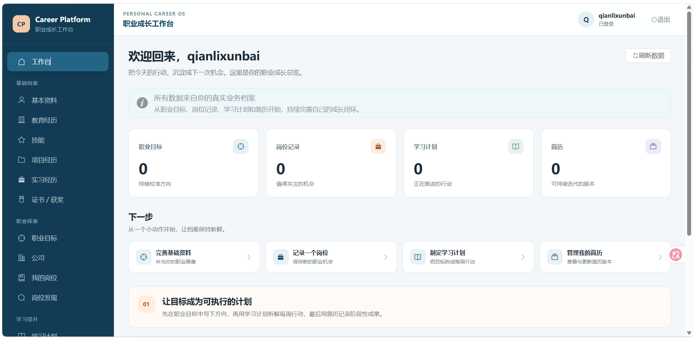
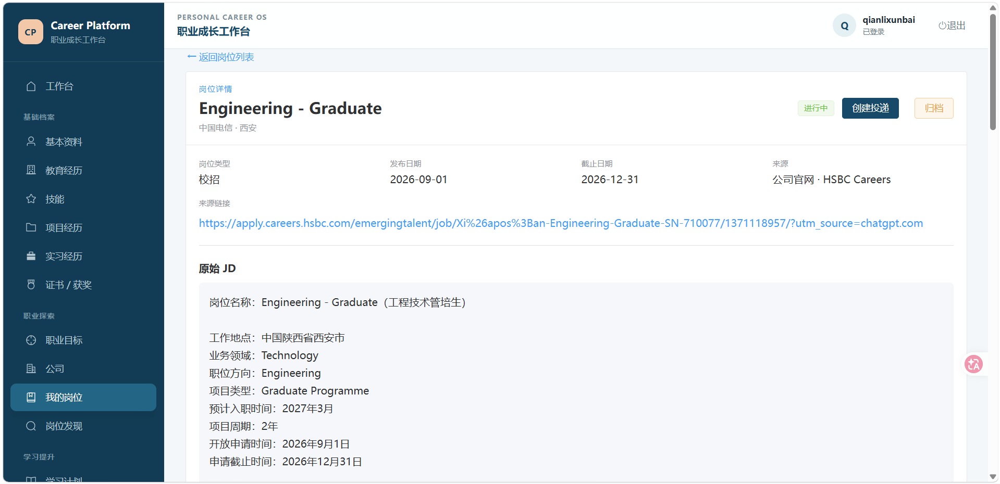
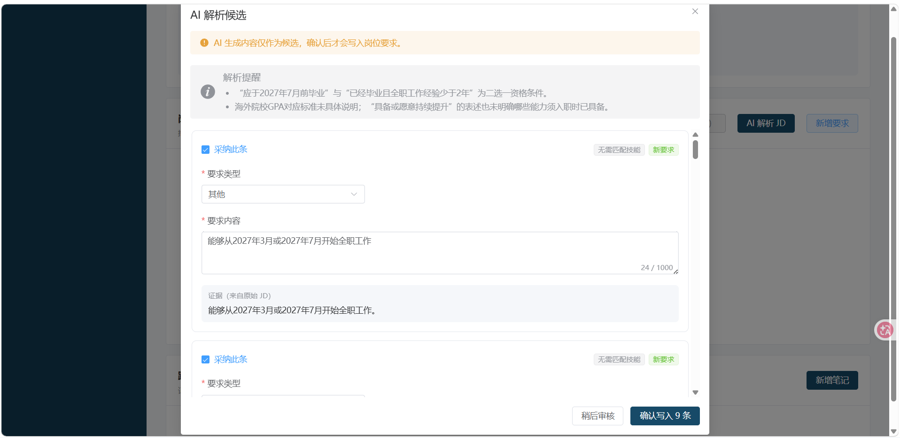
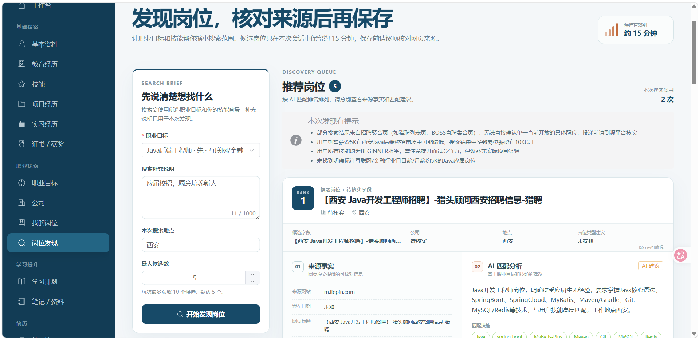
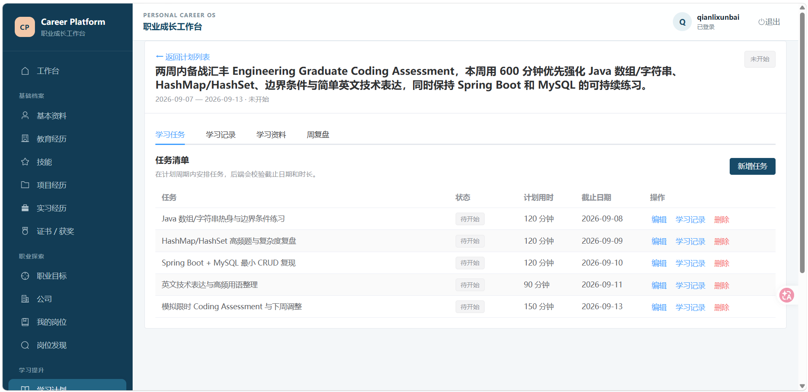
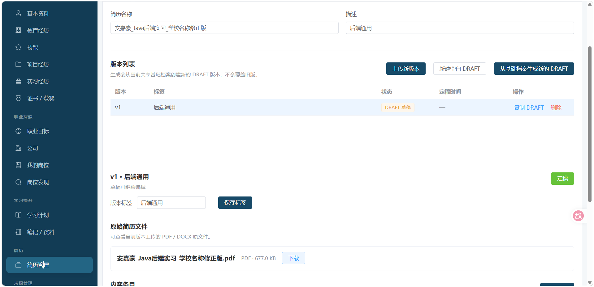

# Career Platform | 大学生职业发展与求职管理平台

> 面向大学生的职业发展与求职管理平台：把职业目标、学习提升、简历版本、岗位投递与复盘串成一个可追溯闭环，并在关键节点提供可确认的 AI 建议。

[项目仓库](https://github.com/qianlixunbai/career-platform) · [开发状态](docs/DEVELOPMENT_STATUS.md) · [系统架构](docs/ARCHITECTURE.md) · [数据库说明](docs/DATABASE.md)

## Overview

Career Platform 是一个前后端分离的职业管理应用。共享基础档案（个人信息、教育、技能、项目、实习、证书/获奖）作为 Career、Learning、Resume、Application 以及 AI 功能的事实源，而不是第五个独立业务模块。

产品覆盖四个核心业务域：职业探索与目标管理、学习提升管理、简历管理、求职过程管理。用户可以从确定目标开始，沉淀岗位与原始 JD，制定学习计划，维护可定稿的简历版本，绑定简历完成投递，记录测评/面试/Offer，并通过复盘反馈到下一轮准备。

本 README 描述当前实现快照；Milestone 的历史决策、验收证据、P0/P1/P2 和已知技术债集中在 [开发状态](docs/DEVELOPMENT_STATUS.md)，不把规划内容当作已完成能力。

## Core Workflow

```text
共享基础档案 + 职业目标
        ↓
岗位 / 公司 / 原始 JD
        ↓
AI 解析、学习建议、岗位发现（候选结果）
        ↓
用户审核与确认 → Java Service 校验 → 学习计划 / 岗位 / 要求入库
        ↓
简历 DRAFT → 编辑 / 复制 → FINALIZED
        ↓
投递 → 测评 / 面试 / Offer → 最终复盘
        ↖                 ↙
       学习资料与有来源问答 ← 复盘反馈
```

AI 只插入“建议和候选”环节；确认前不写正式业务数据。岗位来源事实、模型建议、用户最终确认的记录在界面和 API 中分层呈现。

## Screenshots

以下为项目主展示截图，图片均来自仓库现有资源，未对图片文件做修改。

| 总览与职业探索 | AI 与学习 |
| --- | --- |
| <br>**Dashboard**：职业、学习、简历与投递总览 | <br>**Job Detail**：岗位详情与原始 JD |
| <br>**JD Structured Parse**：结构化要求与 evidence | <br>**Job Discovery**：岗位发现与来源入口 |
| <br>**Learning Plan**：计划、任务与周复盘 | <br>**Learning Materials**：资料列表与问答入口 |
| <br>**RAG Answer**：回答与来源依据 | <br>**Resume Files**：文件与版本管理 |

## Core Modules

| 模块 | 已实现范围 |
| --- | --- |
| Shared Profile | 个人资料、教育经历、技能与熟练度、项目经历、实习经历、证书/获奖；为其他模块提供 owner-scoped 事实源 |
| Career Exploration | CareerGoal、用户私有 Company、Job、JobRequirement、JobNote；保存原始 JD 与岗位观察 |
| Learning | 周计划、任务、学习记录、周复盘、笔记、学习资料；支持 PDF/DOCX 原件、Chunk、Embedding 与资料问答 |
| Resume | Resume、ResumeVersion、ResumeContentItem、ResumeFile；从共享档案生成快照，也支持上传 PDF/DOCX 原件、复制、定稿与下载 |
| Application | 投递、阶段历史、测评、面试、Offer、最终复盘；状态迁移与历史记录在事务内保持一致 |

## Four Formal AI Features

当前正式完成并计入产品范围的 AI 功能为 4 项：

### 1. JD Parse + Evidence

读取用户保存的原始 JD，生成岗位要求候选、技能匹配和可回溯的 `evidenceQuote`。Java Service 在解析阶段校验 evidence 子串、技能名归一化与候选重复项；解析结果是临时候选，不直接写入 `job_requirement`。用户审核、编辑和选择后，确认阶段会校验 JD fingerprint、重复项、Skill 关联规则与正式业务字段，再在事务中追加确认项。

### 2. Learning Planning + Weekly Review

基于用户明确的时间预算、职业目标、结构化岗位要求、技能和有限学习历史生成可编辑学习计划候选。确认后由 Java Service 在单一事务中创建 Plan 与 Tasks；周复盘中的状态、完成率、计划/实际时长和逐任务指标由 Java 计算，AI 只生成建议。将建议应用到表单不会自动覆盖或保存已有 Review。

### 3. Job Discovery + Tool Calling

通过专用 Spring AI Tool Calling gateway 调用真实 Tavily Search，返回候选岗位及可打开的原始来源链接。Java 从 Tavily 结果重建 URL、标题、host、摘要和日期等 `sourceFacts`，AI 仅补充匹配建议、优势、缺口与不确定性；搜索过程不写 Job/Company。用户选择公司、确认岗位字段并显式保存后，才复用既有 `CareerService` 创建岗位。

### 4. RAG Learning Material Q&A

学习资料支持 PDF/DOCX 原件、解析、Chunk 和独立 Embedding；检索限定当前用户与当前计划。模型返回回答和引用 key 后，Java 只从本次检索集重建 `materialId`、Chunk、位置、页码和原文，未知 key 不会成为引用；用户可查看可信引用的原文片段并下载原始资料。RAG 问答是只读能力，不自动修改学习计划或其他业务数据；PDF 保留实际页码，DOCX 使用段落位置，不做 OCR 或页码推算。

## Resume File Management

- 支持上传 PDF / DOCX 原件（单文件大小限制由后端校验），可在创建简历时上传，也可为已有 Resume 新增版本文件。
- 资源层级为 `Resume 1 → n ResumeVersion`；每个版本包含 `0..n ResumeContentItem` 与 `0..1 ResumeFile`，前端可查看文件元数据并下载原件。
- `ResumeVersion` 只有 `DRAFT` 与 `FINALIZED`：DRAFT 可编辑/删除，只有原始文件而没有内容条目的版本也可定稿；FINALIZED 定稿后不可修改，重复定稿保持幂等，原始文件仍可查看和下载。
- 复制版本会创建新的 DRAFT，并 deep-copy 内容行与文件 bytes；源版本和目标版本不共享可变记录。
- `Application` 创建时必须绑定当前用户自己的 `FINALIZED ResumeVersion`；DRAFT 不能用于投递。含 FINALIZED 版本的 Resume 也不能直接删除。

## Key Business Rules

- **Owner boundary**：Service 的查询、更新和删除始终带认证上下文中的 `currentUserId`；跨用户资源统一按不存在处理，不接受客户端提交的 `userId` 作为归属依据。
- **AI write boundary**：AI 输出一律视为不可信候选。流程固定为 `AI proposes → user confirms → Java Service validates/writes`；模型不能生成可信数据库 ID，也不能直接提交事务。
- **Facts vs advice**：外部来源和 Java 重建的来源事实与 AI 建议分开返回、展示和持久化；搜索摘要不能冒充完整 JD，RAG citation 由 Java 重建。
- **Career integrity**：`SKILL` 类型的岗位要求必须引用已有全局 Skill，未解析技能不会被自动创建；Job 只能引用当前用户自己的 Company。
- **Application state**：投递阶段按有限状态机向前迁移，阶段变化与历史追加原子提交；同一用户与同一 Job 的 ongoing Application 受唯一性约束。
- **Resume immutability**：FINALIZED 版本及其内容只读；Profile 后续变化不会回写已经生成的 Resume snapshot。
- **Graceful degradation**：AI、Tavily 或 Embedding 未配置时，传统职业/学习/简历/投递流程仍可运行，对应 AI 入口返回不可用或降级提示，不伪造来源也不自动写库。

## Architecture

### Request and data path

```text
Vue 3 / TypeScript / Router
        ↓ HTTP JSON + Bearer Token
Controller + Request/Response DTO
        ↓ currentUserId / validation
Service（归属、业务规则、状态机、事务）
        ↓
MyBatis-Plus Mapper
        ↓
MySQL 8
```

后端按 `auth`、`common`、`config`、`user`、`profile`、`career`、`learning`、`resume`、`application`、`ai` 分包。认证使用轻量 MVC Interceptor + JWT；除注册/登录外的 `/api/v1/**` 端点要求合法 Bearer Token。

### AI boundaries

```text
owner-owned facts / untrusted external text
        ↓
专用 AI Gateway（structured output / tool calling / RAG）
        ↓ 临时候选、evidence、source keys
前端审核与用户确认
        ↓
Java Service 归属校验、业务校验、事务写入
```

JD/Learning/Job Discovery 使用 no-tools 或专用 tool gateway，互不共享可变的业务 Tool。RAG 的检索、引用 key 和最终 citation 均由 Java 约束；Embedding 使用独立的 OpenAI-compatible endpoint，不引入外部 vector database。

## Tech Stack

| 层次 | 技术 |
| --- | --- |
| Backend | Java 21、Spring Boot 3.5.14、Spring Web、Bean Validation、MyBatis-Plus 3.5.17、Maven、BCrypt、JJWT |
| Data | MySQL 8、MySQL 事务与 owner-aware foreign key |
| AI | Spring AI 1.1.8；DeepSeek 通过 OpenAI-compatible adapter 接入；生产 Chat 模型固定为 `deepseek-v4-flash` |
| Embedding | 独立 OpenAI-compatible HTTPS embedding endpoint；验证环境使用过 Jina，但代码不将 Jina 硬编码为唯一实现 |
| Search | Tavily Search（Job Discovery 的真实外部来源） |
| Frontend | Vue 3、TypeScript、Vite、Vue Router、Axios、Element Plus |

## Project Scale

| 指标 | 当前规模 |
| --- | ---: |
| DDL tables | **30**（29 个 business tables + 1 个 technical table：`learning_material_chunk`） |
| 精确 `@RestController` | **27**（不含 `@RestControllerAdvice`） |
| Routed frontend pages | **21** |
| Formal AI features | **4** |
| Backend regression tests | **327** |
| Ordered SQL scripts | `001`–`009` |

## Testing

| 检查 | 结果 | 证据边界 |
| --- | --- | --- |
| Backend compile | **PASS** | 2026-09-08 final closing 执行结果 |
| Frontend `npm run typecheck` | **PASS** | 2026-09-08 final closing 执行结果 |
| Frontend `npm run build` | **PASS** | 2026-09-08 final closing 执行结果 |
| Full Maven regression | **327 / 327 PASS** | **2026-09-07 最近一次完整回归**；本轮未重跑，不能表述为本轮 Full Maven 结果 |

最近一次完整 Maven 回归于 2026-09-07 执行，327 / 327 PASS。完整回归与 Resume File 历史验收记录见 [开发状态](docs/DEVELOPMENT_STATUS.md)；专项验收记录见 [M6B Closing](docs/M6B_CLOSING_VERIFICATION.md)、[M6C Closing](docs/M6C_CLOSING_VERIFICATION.md) 与 [M7 RAG Closing](docs/M7_RAG_CLOSING_VERIFICATION.md)。

## Quick Start

### Prerequisites

- Java 21
- MySQL 8
- Node.js / npm（运行前端）

### 1. Prepare the database

创建 `career_platform` 数据库（字符集使用 `utf8mb4`），然后按顺序执行以下脚本：

1. [`sql/001_create_app_user.sql`](sql/001_create_app_user.sql)
2. [`sql/002_create_shared_profile_tables.sql`](sql/002_create_shared_profile_tables.sql)
3. [`sql/003_create_career_exploration_tables.sql`](sql/003_create_career_exploration_tables.sql)
4. [`sql/004_create_learning_tables.sql`](sql/004_create_learning_tables.sql)
5. [`sql/005_create_resume_tables.sql`](sql/005_create_resume_tables.sql)
6. [`sql/006_create_application_tables.sql`](sql/006_create_application_tables.sql)
7. [`sql/007_add_learning_material_rag.sql`](sql/007_add_learning_material_rag.sql)
8. [`sql/008_add_profile_email.sql`](sql/008_add_profile_email.sql)
9. [`sql/009_add_resume_file.sql`](sql/009_add_resume_file.sql)

`007`–`009` 为增量迁移脚本。对于已经应用过对应变更的数据库，请先确认当前 schema 状态后再执行，避免重复 `ALTER`。

### 2. Configure local environment

只在本机环境变量或 IDE Run Configuration 中提供以下名称，README 不记录任何值：

- Database / JWT：`DB_USERNAME`、`DB_PASSWORD`、`JWT_SECRET`、`JWT_EXPIRATION_SECONDS`
- Chat AI：`AI_CHAT_ENABLED`、`AI_JD_PARSE_ENABLED`（兼容旧开关）、`AI_CHAT_PROVIDER`、`AI_API_KEY`
- Tavily：`TAVILY_SEARCH_ENABLED`、`TAVILY_API_KEY`
- Embedding：`EMBEDDING_ENABLED`、`EMBEDDING_ENDPOINT`、`EMBEDDING_MODEL`、`EMBEDDING_VERSION`、`EMBEDDING_API_KEY`

AI、Tavily 和 Embedding 配置均为可选。缺少 Chat 配置时传统业务仍可使用；缺少 Tavily 时 Job Discovery 不执行外部搜索；缺少 Embedding 或其 endpoint/model 时资料管理仍可保留，但语义检索与 RAG 问答会降级为不可用提示。任何密码、Token、API key 都不得写入源码、README 或 Git。

### 3. Start backend and frontend

```powershell
.\mvnw.cmd spring-boot:run
```

```powershell
cd frontend
npm install
npm run dev
```

后端默认使用 `src/main/resources/application.properties` 中的数据库与 AI 配置映射；Unix-like 环境使用 `./mvnw`。

## Design Principles

1. **AI proposes, human confirms**：AI 是候选生成器，不是业务事实源；任何需要持久化的结果都必须经过用户确认。
2. **Java owns truth and writes**：归属校验、字段/状态/重复校验、事务和数据库写入统一由 Java Service 负责。
3. **Facts are not advice**：原始来源、结构化字段、证据片段与模型建议分别建模，不能把推断包装成外部事实。
4. **Secure by ownership**：资源边界以认证上下文为准，错误 owner/父级组合不泄露资源存在性；外部文本和模型输出全部按不可信输入处理。
5. **Graceful, bounded AI**：AI 默认 opt-in，Provider 失败不拖垮传统业务；RAG、文件、候选缓存和上下文都有明确的容量与生命周期边界。
6. **Course-scale by intent**：当前实现聚焦可验证的课程级闭环；AI 面试/求职复盘、Resume + JD matching、通用 Agent、AI Evaluation、RBAC/OAuth、Redis/MQ/Elasticsearch 和管理员/HR 端不属于当前已完成范围。

## Documentation

- [开发状态与历史验收](docs/DEVELOPMENT_STATUS.md)：Milestone 记录、验证边界、已知技术债与未实现范围。
- [系统架构](docs/ARCHITECTURE.md)：分层、AI gateway、owner 边界、Resume 与 RAG 约束。
- [数据库说明](docs/DATABASE.md)：表关系、迁移顺序、约束与当前 schema 口径。
- [项目规划](docs/PROJECT_PLAN.md)：原始业务范围、目标用户、风险与演进方向。
- [M6B Closing Verification](docs/M6B_CLOSING_VERIFICATION.md)：Learning AI 历史验收证据。
- [M6C Closing Verification](docs/M6C_CLOSING_VERIFICATION.md)：Tavily Job Discovery 历史验收证据。
- [M7 RAG Closing Verification](docs/M7_RAG_CLOSING_VERIFICATION.md)：文件、Embedding、RAG citation 与 MySQL/Provider 门禁证据。
- [原始开工方案](docs/reference/大学生职业发展与求职管理平台_项目开工方案_v1.md)：初始设计基线，不作为当前实时状态。
