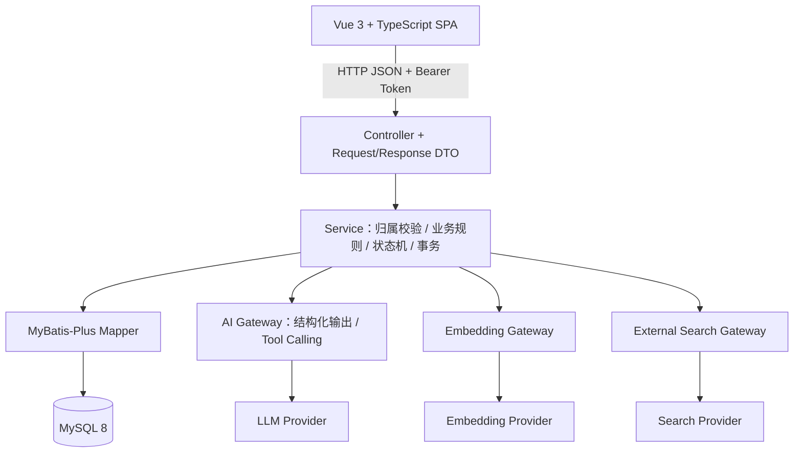
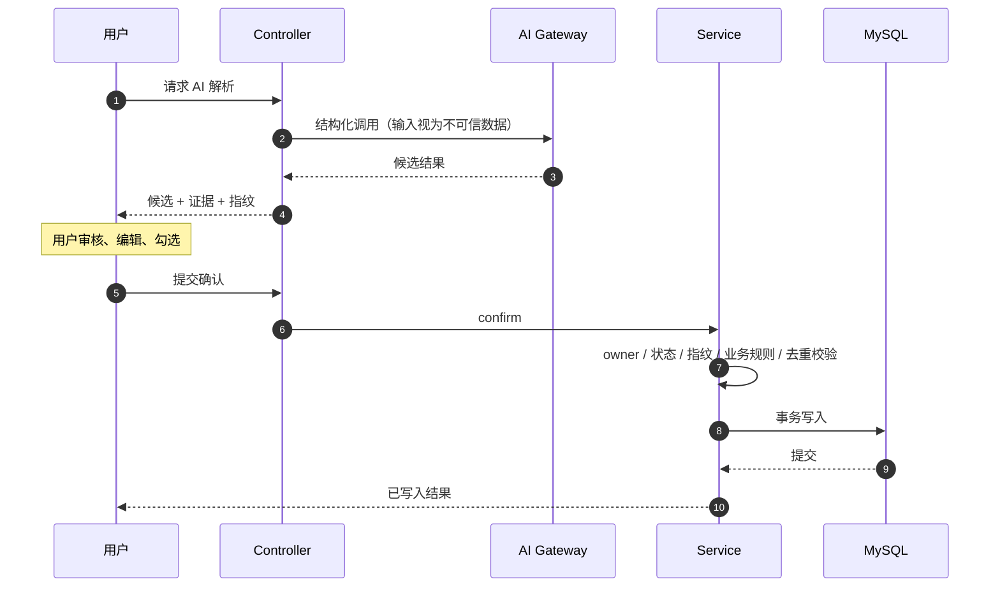
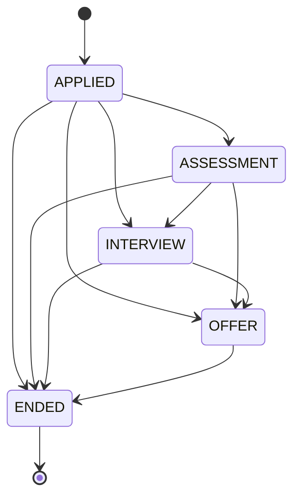

# 系统架构与设计决策

本文记录 Career Platform 的分层结构，以及几个关键设计点的取舍原因。业务范围见 [业务设计说明](DESIGN.md)，表结构见 [数据库设计](DATABASE.md)。

## 1. 分层结构



后端按业务域分包：

```
com.careerplatform
├── auth          JWT 签发与校验、拦截器、当前用户参数解析
├── common        统一异常与错误响应
├── config        密码编码、Web MVC 装配
├── user          注册登录、账号状态
├── profile       共享基础档案（教育、技能、项目、实习、证书）
├── career        职业目标、公司、岗位、岗位要求、岗位笔记
├── learning      学习计划、任务、记录、周复盘、笔记、学习资料
├── resume        简历、版本、内容条目、原件文件
├── application   投递、阶段历史、测评、面试、Offer、最终复盘
└── ai            AI 网关、Prompt、候选校验、RAG 与岗位发现编排
```

职责边界：

- **Controller** 只做协议转换与参数校验，不包含业务判断。
- **Service** 承担归属校验、业务规则、状态迁移与事务边界，是唯一允许写库的层次。
- **Mapper** 只做数据访问；需要行锁或复杂过滤时使用显式 SQL，其余场景使用 MyBatis-Plus 的条件构造器。

## 2. 认证与归属边界

采用轻量 MVC Interceptor + JWT，而不是引入完整的安全框架：

- 除注册与登录外的所有 `/api/v1/**` 端点都要求合法 Bearer Token；Token 无效、过期或账号被禁用统一返回 401。
- 拦截器校验通过后把当前用户 ID 写入请求上下文，Controller 通过参数解析器注入，**客户端提交的任何 userId 都不作为归属依据**。
- Service 的查询、更新、删除始终带 `currentUserId` 条件。跨用户访问统一按"资源不存在"处理，不泄露资源是否存在。

选择轻量的原因：当前只有单一身份类型，没有角色、权限组或第三方登录的需求。引入完整安全框架会带来配置复杂度而没有对应的业务收益；出现 RBAC 或多认证方式时再评估。

## 3. AI 写入边界

这是整个项目最重要的一条架构约束：**AI 的输出一律视为不可信候选，绝不直接写入业务表。**



具体约束：

- **候选不落库**：解析阶段只返回候选、证据片段与警告，不产生任何业务表写入。
- **指纹校验**：解析结果携带原始 JD 的 SHA-256 指纹；确认时重新计算并比对，不一致说明源数据已变化，拒绝确认并要求重新解析。
- **规则校验**：确认阶段重新执行 owner 校验、资源状态校验、技能关联规则校验与归一化去重，而不是信任前端提交的勾选结果。
- **单事务写入**：需要写入多行时（例如学习计划与其任务）在同一个事务内完成，避免部分写入。
- **确认不再调用 AI**：确认接口是纯 Java 逻辑，模型不参与，也不产生新的不确定性。
- **降级可用**：AI、外部搜索、向量服务均为可选配置。未配置时传统业务链路完整可用，相关入口返回明确的不可用提示，不伪造数据。

### 3.1 岗位发现的外部搜索

- **模型看不到真实 URL**：搜索结果在服务端被分配不透明键，模型只能引用键；URL 与来源事实由 Java 从请求级会话中取回。
- **SSRF 防护**：仅允许 http/https；拒绝携带用户信息的 URL；拒绝 localhost、`.local` 域名、IPv4 私有段与保留段、IPv6 ULA 等内网目标；按规范化 URL 去重。
- **传输加固**：endpoint 为编译期常量，不可由请求或环境变量覆盖；HTTP 客户端禁用重定向，设置连接与请求超时，并对响应体做流式大小限制（超限立即取消读取，防止"先发响应头再挂住"）。
- **事实与建议分层**：来源事实（URL、标题、host、摘要、明确给出的日期）与模型建议分开建模与返回。搜索摘要不会被提升为完整 JD，日期只取来源显式提供的字段，不做推断。
- **预算控制**：限制工具调用次数与模型请求次数，超限即拒绝而不是继续重试。
- **诊断封闭**：内部错误按固定的规则枚举分类记录，不把模型或外部服务返回的原文写入日志，避免敏感信息经日志外泄。

### 3.2 RAG 可信引用

- **检索边界在 SQL 层**：候选分片的查询同时限定 `user_id`、`plan_id`、资料索引状态与 embedding 身份；Java 侧对返回行再做一次防御性校验。
- **引用由 Java 重建**：模型只返回引用键，真实的资料 ID、分片 ID、位置标签、页码与原文全部由 Java 从本次检索集重建；未知引用键直接判为非法返回。
- **I/O 后复检**：模型调用完成后重新确认引用仍然存在且原文未被修改，避免把已变更的证据当作依据返回。
- **无证据不编造**：检索不到满足阈值的证据时直接返回"依据不足"，且不调用模型。
- **只读能力**：问答不修改任何业务数据。
- **向量身份**：embedding 的 endpoint / model / version 组合的摘要作为向量身份参与检索条件；更换模型后旧向量不会被检索命中，必须重新索引。

## 4. 并发与事务设计

### 4.1 投递状态机



- 允许向前跳级（例如从 `APPLIED` 直接进入 `INTERVIEW`），`ENDED` 为终态，任何从终态出发的迁移都被拒绝。
- Offer 的接受 / 拒绝会驱动投递进入 `ENDED`，并在同一事务内写入对应的结束原因。

### 4.2 为什么需要三层并发保障

同一个业务不变量（例如"同一用户同一岗位只能有一个进行中的投递"）在并发下容易被破坏，只靠一层机制都有盲区：

1. **应用层状态机**：拒绝非法迁移，但无法阻止两个并发请求都通过状态检查。
2. **前置状态条件更新（CAS）与行锁**：更新时带上前置状态，命中 0 行说明状态已被他人改变；对"检查 + 写入"的复合操作（创建投递、创建/更新 Offer、写最终复盘）在父资源上加行锁，把并发请求串行化。
3. **数据库唯一约束**：作为最后一道防线，即使前两层都因某种原因失效，数据库仍会拒绝重复数据；Service 捕获唯一键冲突并映射为 409。

阶段变更与历史记录追加在同一个事务内提交，因此非法迁移不会留下"状态没变但历史多了一条"的半写记录。

### 4.3 长耗时操作与事务的边界

外部调用（模型、向量、搜索）耗时长且可能失败，因此**不在数据库事务内进行网络调用**：

- 文件上传与索引：owner 校验 → 校验与解析 → 短事务写入原件 → 事务外调用向量服务 → 短事务替换分片并置为就绪。
- 索引过程中若资料被替换，通过内容摘要比对发现并拒绝写入。
- 失败时保留原件供重试；已有可用索引的资料在重建失败时保留旧索引，不会让可用状态退化。

## 5. 安全设计

- **密码**：使用 BCrypt 编码，登录时统一返回"凭证无效"，不区分用户名不存在与密码错误。
- **JWT**：使用 HMAC 签名，密钥必须至少 32 字节；校验签名与过期时间，并检查账号是否处于可用状态。
- **文件上传**：校验文件头魔数与文档结构，不信任扩展名与客户端声明的 MIME；限制单文件大小、ZIP 条目数与解压后总字节数（防压缩炸弹）；清洗文件名中的路径穿越字符。
- **大对象读取**：原件以 BLOB 存储，但普通查询不读取该列，只有显式的下载接口按 owner 读取；响应带 `nosniff` 与安全的内容处置头。
- **不可信输入**：外部文本与模型输出一律作为数据而非指令处理；Prompt 中明确要求忽略输入内的指令性内容。
- **凭据管理**：所有密钥与密码只从本地配置或环境变量读取，不写入源码与文档。

## 6. 数据访问

- 使用 MyBatis-Plus 而非 JPA：项目需要显式控制 SQL 边界（行锁、owner 条件的复合 JOIN、条件更新），显式 SQL 更直观也更容易审查。
- 需要行锁时使用显式 SQL；其余场景使用条件构造器，避免字符串拼接。
- 需要"当前用户 + 父级资源"双重条件时，把两个条件同时写在查询里，而不是先查父级再查子级，避免越权路径。
- 数据库层面使用 owner-aware 复合外键，使跨用户引用在数据库层就无法成立。
