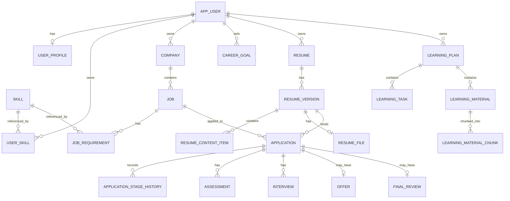

# 数据库设计

本文说明 Career Platform 的表结构、约束与迁移顺序。整体架构见 [系统架构与设计决策](ARCHITECTURE.md)，业务范围见 [业务设计说明](DESIGN.md)。

## 1. 核心实体关系

下图只画出核心业务实体的主要关系，省略共享档案明细表与过程记录表。

## 2. 表清单

当前共 **30 张表**：29 张业务表 + 1 张检索分片技术表（`learning_material_chunk`）。

### 用户与共享档案

| 表 | 关系 | 关键约束与索引 |
| --- | --- | --- |
| `app_user` | 用户根实体 | `username` UNIQUE |
| `user_profile` | 用户 1 → 0..1 | `user_id` UNIQUE、FK → `app_user` |
| `education_experience` | 用户 1 → n | FK → `app_user`；`(user_id, id)` 索引 |
| `skill` | 全局技能字典 | `name` UNIQUE |
| `user_skill` | 用户 n ↔ n 技能 | `(user_id, skill_id)` UNIQUE；两个 FK；`skill_id` 索引 |
| `project_experience` | 用户 1 → n | FK → `app_user`；`(user_id, id)` 索引 |
| `internship_experience` | 用户 1 → n | FK → `app_user`；`(user_id, id)` 索引 |
| `certificate_award` | 用户 1 → n | FK → `app_user`；`(user_id, id)` 索引 |

### 职业探索

| 表 | 关系 | 关键约束与索引 |
| --- | --- | --- |
| `career_goal` | 用户 1 → n | FK → `app_user`；`(user_id, status, updated_at)` |
| `company` | 用户 1 → n | FK → `app_user`；`(user_id, name)`；`(id, user_id)` UNIQUE 供复合 FK 使用 |
| `job` | 用户 1 → n；公司 1 → n | FK → `app_user`；`(company_id, user_id)` 复合 FK → `company(id, user_id)` |
| `job_requirement` | 岗位 1 → n | FK → `job`；可选 FK → `skill` |
| `job_note` | 岗位 1 → n | FK → `job`；`(job_id, created_at)` |

`job` 自身保存 `user_id`，使岗位明确知道自己属于谁，也让数据库可以直接阻止跨用户的公司关联。`job_requirement` 与 `job_note` 通过父岗位继承归属，应用层在操作子资源前先校验父岗位的 owner。

### 学习提升

| 表 | 关系 | 关键约束与索引 |
| --- | --- | --- |
| `learning_plan` | 用户 1 → n | `(user_id, week_start)` UNIQUE；`(id, user_id)` UNIQUE；owner FK |
| `learning_task` | 计划 1 → n | `(id, user_id)`、`(id, plan_id, user_id)` UNIQUE；`(plan_id, user_id)` 索引 |
| `study_record` | 任务 1 → n | `(task_id, user_id)` 索引；任务 owner 复合 FK |
| `weekly_review` | 计划 1 → 0..1 | `plan_id` UNIQUE；计划 owner 复合 FK |
| `learning_note` | 计划 1 → n；可选任务 | `(plan_id, user_id)`、`(task_id, plan_id, user_id)` 索引 |
| `learning_material` | 计划 1 → n；可选任务 | `(plan_id, user_id)`、`(task_id, plan_id, user_id)` 索引；`source_url VARCHAR(2048) NULL` |
| `learning_material_chunk` | 资料 1 → n（技术表） | `UNIQUE(material_id, chunk_index)`；`(material_id, user_id)` 复合 FK 且 `ON DELETE CASCADE` |

学习域共 13 个外键，全部为默认 `RESTRICT`。各表直接保存 `user_id`，并通过计划 / 任务的 owner-aware 复合外键阻止跨用户或错误父子组合。owner、日期与删除顺序的校验由 Service 负责，不依赖数据库异常替代业务校验。

`learning_material_chunk` 保存位置标签、可空页码、原文、JSON 形式的向量与向量身份。资料列表查询不读取原件 BLOB；删除资料时由数据库级联清理分片。

### 简历

| 表 | 关系 | 关键约束与索引 |
| --- | --- | --- |
| `resume` | 用户 1 → n | FK → `app_user`；`(id, user_id)` UNIQUE 供复合 FK 使用 |
| `resume_version` | 简历 1 → n | `(resume_id, version_no)` UNIQUE；`(id, user_id)` UNIQUE；`(resume_id, user_id)` 复合 FK |
| `resume_content_item` | 版本 1 → n | `(version_id, user_id)` 复合 FK → `resume_version(id, user_id)` |
| `resume_file` | 版本 1 → 0..1 | `UNIQUE(resume_version_id)`；`file_data MEDIUMBLOB` 与文件元数据；`(resume_version_id, user_id)` 复合 FK |

关系固定为 `Resume 1 → n ResumeVersion`，每个版本有 `0..n` 内容条目，并可有 `0..1` 原件文件。投递只允许绑定已定稿（`FINALIZED`）的版本。四张表均为 InnoDB、`utf8mb4_unicode_ci`。

### 求职过程

| 表 | 关系 | 关键约束与索引 |
| --- | --- | --- |
| `application` | 用户 + 岗位 + 定稿简历版本 | `(id, user_id)` UNIQUE；`(user_id, ongoing_job_id)` UNIQUE；岗位 FK；版本 owner 复合 FK |
| `application_stage_history` | 投递 1 → n | `(application_id, user_id)` owner 复合 FK；按变更时间追加查询索引 |
| `assessment` | 投递 1 → n | 投递 owner 复合 FK；`scheduled_at` 索引 |
| `interview` | 投递 1 → n | 投递 owner 复合 FK；`round_no` 索引 |
| `offer` | 投递 1 → 0..1 | `application_id` UNIQUE；投递 owner 复合 FK |
| `final_review` | 投递 1 → 0..1 | `application_id` UNIQUE；投递 owner 复合 FK |

`application.ongoing_job_id` 是一个 STORED 生成列：投递进行中时等于 `job_id`，结束时为 `NULL`。由于 MySQL 的唯一索引允许多行 `NULL`，这个设计让"同一用户同一岗位最多一条进行中投递"与"可保留多条已结束历史"同时成立。

## 3. 枚举取值

以下取值由 Java enum 与业务校验约束，当前 SQL 未额外添加 `CHECK` 约束。

| 字段 | 取值 |
| --- | --- |
| `app_user.status` | `ACTIVE`、`DISABLED` |
| `user_skill.proficiency` | `BEGINNER`、`FAMILIAR`、`PROFICIENT` |
| `certificate_award.type` | `CERTIFICATE`、`AWARD` |
| `career_goal.status` | `ACTIVE`、`PAUSED`、`ACHIEVED` |
| `job.job_type` | `FULL_TIME`、`INTERNSHIP`、`CAMPUS`、`PART_TIME`、`CONTRACT`、`OTHER` |
| `job.source_type` | `MANUAL`、`CAMPUS_SITE`、`COMPANY_WEBSITE`、`RECRUITMENT_PLATFORM`、`REFERRAL`、`OTHER` |
| `job_requirement.requirement_type` | `SKILL`、`EDUCATION`、`MAJOR`、`EXPERIENCE`、`LANGUAGE`、`OTHER` |
| `learning_plan.status` | `PLANNED`、`IN_PROGRESS`、`COMPLETED` |
| `learning_task.status` | `TODO`、`IN_PROGRESS`、`DONE`、`SKIPPED` |
| `resume_version.status` | `DRAFT`、`FINALIZED` |
| `resume_content_item.section_type` | `PROFILE`、`EDUCATION`、`SKILL`、`PROJECT`、`INTERNSHIP`、`CERTIFICATE` |
| `application.current_stage` | `APPLIED`、`ASSESSMENT`、`INTERVIEW`、`OFFER`、`ENDED` |
| `offer.status` | `CONSIDERING`、`ACCEPTED`、`REJECTED` |
| `assessment.type` | `ONLINE_ASSESSMENT`、`WRITTEN_TEST`、`CODING_TEST`、`OTHER` |
| `assessment.result` | `PENDING`、`PASSED`、`FAILED`、`OTHER` |
| `interview.type` | `HR`、`TECHNICAL`、`MANAGER`、`FINAL`、`OTHER` |
| `interview.result` | `PENDING`、`PASSED`、`REJECTED`、`OTHER` |

## 4. 迁移脚本

| 文件 | 内容 |
| --- | --- |
| `sql/001_create_app_user.sql` | 用户表 |
| `sql/002_create_shared_profile_tables.sql` | 共享档案 7 张表 |
| `sql/003_create_career_exploration_tables.sql` | 职业探索 5 张表 |
| `sql/004_create_learning_tables.sql` | 学习提升 6 张表 |
| `sql/005_create_resume_tables.sql` | 简历 3 张表 |
| `sql/006_create_application_tables.sql` | 求职过程 6 张表 |
| `sql/007_add_learning_material_rag.sql` | 资料原件字段与检索分片表 |
| `sql/008_add_profile_email.sql` | 档案邮箱字段（增量 `ALTER`） |
| `sql/009_add_resume_file.sql` | 简历原件文件表 |

建表脚本使用 `CREATE TABLE IF NOT EXISTS`，不会删除表或业务数据。`007` 与 `008` 是一次性 `ALTER TABLE` 增量脚本，重复执行前需先确认当前 schema 状态。已有脚本的语义不应被改写，结构变化应新增有序脚本。

## 5. 数据安全原则

- 只保存 BCrypt 密码哈希，不保存明文密码。
- 数据库账号密码与 JWT 密钥只从本地配置或环境变量读取，不写入 SQL、源码或文档。
- 字段使用 Java 小驼峰与数据库下划线自动映射。
- 需要"当前用户 + 父级资源"双重条件时，两个条件同时出现在查询中，避免越权路径。
- owner-aware 复合外键使跨用户引用在数据库层就无法成立。
